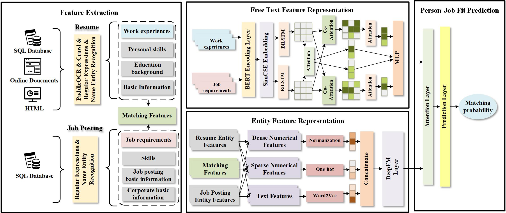

# Code for paper *Your Profile Reveals Your Traits in Talent Market: An Enhanced Person-Job Fit Representation Learning* 


## Overview

We proposed a novel **A**ttentive **P**erson-**J**ob **F**it **M**ultifaceted semantic feature **F**usion model (**APJFMF**).




## Requirements

if you want to run **the whole project**, you need to require the following environments:

```
pytorch==1.8.1+cu102
transformers==3.4.0
pandas==1.3.5
gensim==3.8.3
skilt-learn==1.0.2
jieba==0.39
transformers==3.4.0
paddleocr>=2.0.1
lanms-neo==1.0.2
PyMuPDF==1.19.0
PaddlePaddle
shapely
scikit-image
imgaug
pyclipper
lmdb
tqdm
numpy
visualdl
rapidfuzz
opencv-python
opencv-contrib-python
cython
lxml
premailer
openpyxl
attrdict
Polygon3
```

If you only need to run the **feature representation part**, you need to configure the following environment:
```
pytorch==1.8.1+cu102
transformers==3.4.0
pandas==1.3.5
gensim==3.8.3
skilt-learn==1.0.2
jieba==0.39
transformers==3.4.0
```

If you want to **structure and parse resumes**, you need to have the following environment:
```
paddleocr>=2.0.1
lanms-neo==1.0.2
PyMuPDF==1.19.0
PaddlePaddle
shapely
scikit-image
imgaug
pyclipper
lmdb
tqdm
numpy
visualdl
rapidfuzz
opencv-python
opencv-contrib-python
cython
lxml
premailer
openpyxl
attrdict
Polygon3
```


## File Structure


